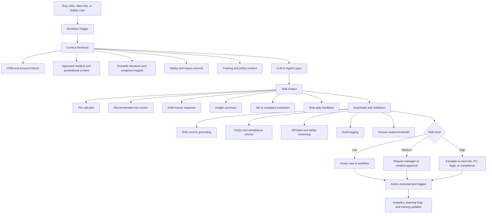

# Competitive / Complementary Landscape

> AI Generated Research Report
> 

# AI Tools for Pharmaceutical Sales Representatives and Medical Science Liaisons

## Executive summary

The market for AI tools serving pharmaceutical sales representatives and medical science liaisons is now real, but unevenly mature. The most deployable products are not fully autonomous “digital reps” or “digital MSLs.” They are grounded, workflow-embedded assistants that sit inside CRM, medical information, safety, and training systems and help users prepare for calls, retrieve approved content, document interactions, route medical inquiries, capture adverse events, and prioritize territory actions. Veeva, Salesforce, IQVIA, Aktana, Within3, Sorcero, H1, ArisGlobal, and ACTO illustrate this shift from generic copilots toward domain-specific agents with guardrails, auditability, and ties to approved content and structured records. 

The strongest use cases today are bounded by regulated content and clear handoffs. These include pre-call planning, next-best-action recommendations, compliant free-text capture, KOL/HCP intelligence, medical inquiry intake and fulfillment, literature and congress insight synthesis, and adverse-event or product-quality complaint intake. By contrast, unsupervised external scientific communication and autonomous promotional outreach remain much less mature because they raise accuracy, off-label, safety-reporting, privacy, and auditability risks. Recent academic work on medical-affairs AI, medical RAG, and pharmacovigilance supports this pattern: performance improves materially when models are grounded in retrieved evidence, structured ontologies, or iterative retrieval loops instead of asked to answer from model memory alone. 

Commercial architecture is converging on a common pattern: a domain-tuned LLM or agent layer, retrieval over approved scientific/commercial content, connectors into CRM and engagement records, workflow controls for escalation and approval, and compliance instrumentation such as audit logs, access controls, human review, and source-grounding. Knowledge-graph and graph-RAG approaches are emerging for KOL mapping, multi-hop scientific reasoning, and explainability, while multimodal capabilities are arriving through voice note capture, translation, video role-play scoring, and AI-assisted case intake. 

For adoption, the highest-value path is staged. Start with grounded copilots in systems of record and content repositories; then add decisioning for territory planning and insight generation; then integrate AI-enabled onboarding and role-play; then expand into safety and medical-information automation with explicit human review; and only after that consider higher-autonomy multi-step agent workflows. Governance must be cross-functional from day one, with Commercial, Medical, Pharmacovigilance, Compliance, Privacy, IT, Quality, and Legal all involved. 

## Market landscape and current use cases

The current market splits into four practical layers. First are **systems of record and engagement platforms** such as Veeva Vault CRM, Salesforce Life Sciences Cloud, and IQVIA OCE, which embed AI directly in field and medical workflows. Second are **decisioning and orchestration layers** such as Aktana, which focus on next-best-action, explainability, and omnichannel optimization. Third are **medical-affairs intelligence layers** such as Within3, Sorcero, and H1, which specialize in insight extraction, scientific engagement, and KOL/HCP mapping. Fourth are **safety and enablement layers** such as ArisGlobal, ACTO, and Qstream, which respectively target adverse-event and medical-information workflows or field training and simulation. 

For **customer engagement**, the state of the art is less about autonomous messaging and more about helping humans decide whom to engage, with what content, through which channel, and at what moment. Veeva positions Vault CRM as an “agentic CRM” connecting sales, marketing, and medical on a single platform, with embedded AI for profile-driven engagement and content management. Salesforce positions Life Sciences Cloud for Customer Engagement as a native application for commercial and medical field teams, and IQVIA OCE is designed to connect sales, marketing, medical, and other customer-facing functions. Aktana’s platform is specifically built to surface AI-guided next actions inside the tools teams already use. 

For **content generation**, the practical frontier is “approved-content-adjacent” generation rather than unrestricted generation. Veeva AI for Vault CRM focuses on agentic call reports, voice, media, and compliant free-text capture. Sorcero emphasizes medically tuned AI plus review workflows and hallucination grading. ACTO’s LAICA emphasizes succinct, accurate, MLR-approved answers for field teams. Indegene reports deployments for standard-response-document generation and RAG-based reporting acceleration, which is notable because it shows how medical-information and regulatory-adjacent generation are moving from pilot to production when constrained by sources and review. 

For **medical inquiry handling**, the most mature products remain workflow systems that can now be enhanced by GenAI, rather than pure chatbots. Veeva MedInquiry is a GxP-compliant medical inquiry management application that accepts requests from phone, email, CRM, and websites and can receive inquiries automatically. Salesforce’s customer-engagement data model explicitly includes medical inquiries, adverse events, and product-quality complaints. ArisGlobal’s LifeSphere Medical Affairs and ReporterX connect medical information, safety, and intake automation. Academic work on LLMs as drug-information providers and on medical RAG suggests that evidence-grounded answer generation can support this domain, but not safely without source retrieval, validation, and human review. 

For **CRM integration and territory planning**, the strongest vendors are Veeva, Salesforce, IQVIA, Aktana, and H1. Veeva and Salesforce provide full CRM and engagement workflows. IQVIA combines orchestration, analytics, and AI assistant capabilities. Aktana specializes in transparent NBA/NBE-style guidance. H1 brings HCP/KOL intelligence and demonstrates MSL territory alignment using claims and scholarly data. In practice, this means the best current deployments combine a system of record with a recommendation layer and an external HCP-intelligence layer, rather than relying on a single product to do everything. 

For **adverse-event detection and escalation**, automation is strongest in intake, extraction, literature screening, and case triage rather than final pharmacovigilance judgment. ArisGlobal advertises AI-powered intake, literature intelligence, signal detection, dynamic extraction, translation, and follow-up management. Salesforce and Veeva both support capture of adverse-event-related interactions inside broader field workflows. Academic pharmacovigilance literature shows meaningful progress with BERT-class models, LLMs, and ChatGPT-like tools for detecting adverse events or screening literature, but also emphasizes error modes, explainability, and the need for expert review. 

For **compliance**, the clear pattern is that commercial vendors now market guardrails as a core product feature, not a separate workstream. Veeva describes deep application-specific prompts and safeguards in Vault AI. Salesforce anchors its offering in the Trust Layer. Aktana emphasizes explainability, traceability, encryption, and audit logs. Sorcero foregrounds hallucination grading, audit-ready security, and medically tuned AI. This is significant because, in pharma, usefulness and compliance are increasingly sold as a bundled proposition. 

## Vendor landscape

### Top vendor comparison

The table below compares eight vendors that currently define the most visible commercial landscape for rep/MSL AI workflows. This is not a market-share ranking; it is a practical comparison of breadth, maturity, and relevance to the user request.

| Vendor | Product | Core capabilities | Target user | Deployment model | Data sources | Compliance features | Pricing |
| --- | --- | --- | --- | --- | --- | --- | --- |
| Veeva | Vault CRM, Veeva AI, MedInquiry | Agentic CRM, pre-call planning, voice/media/text agents, compliant call reporting, approved content sharing, medical inquiry intake/fulfillment | Rep + MSL/medical info | SaaS cloud on Vault; browser/desktop plus offline iPad/iPhone; customer LLM choice for CRM Bot | Unified customer database, CRM activity, approved content, MedComms, MedInquiry | GxP-compliant MedInquiry, application-specific safeguards, ISO 27001/27018, SOC 2, real-time compliance checks | Veeva AI for Vault CRM available at no cost through 2030; core CRM pricing not public |
| Salesforce | Life Sciences Cloud for Customer Engagement, Agentforce | Visit planning/execution, content sharing, samples/consent, medical inquiry and adverse-event capture, AI agents, unified data model | Rep + MSL | Native cloud SaaS | Data Cloud, HCP/customer records, engagement data, industry objects | Trust Layer, built-in data security, HIPAA support, industry-compliant data model | Enterprise $350/user/month; Unlimited $525/user/month; add-ons extra |
| IQVIA | OCE, Orchestrated Analytics, IQVIA AI Assistant, Next Best | Omnichannel orchestration, analytics, conversational AI, next-best-action inside workflow | Rep + MSL | SaaS cloud | IQVIA data assets, commercial/medical engagement data, CRM and analytics layers | Privacy/security approach with experts in the loop; Healthcare-grade AI; compliance-forward positioning | Custom quote |
| Aktana | Omnichannel intelligence platform | Personalized next-best actions/experiences, KOL prioritization, medical-affairs suggestions, orchestration, explainability | Rep + MSL | Secure global cloud | CRM/engagement data, historical interactions, channel/timing signals, KOL activity | GDPR-focused cloud controls, encryption at rest/in transit, audit logs, explainable AI | Custom quote |
| Within3 | Launch Intelligence and Insights Management Platform | AI-powered insight capture/reporting, social listening, congress analysis, virtual advisory boards, MSL collaboration | MSL-first, also commercial | Hosted SaaS over the internet | Field activity, HCP engagement, social sentiment, claims, congress inputs | Secure/compliant platform, annual SOC 2 Type II audits, enterprise hosting/backup/DR | Custom quote |
| Sorcero | Sorcero Medical, Intelligence Platform | Medically tuned AI, evidence synthesis, insights analytics, congress intelligence, content generation, KOL planning | MSL/medical affairs | SaaS cloud | Structured and unstructured medical data, scientific data pool, enterprise integrations | SOC 2 Type II, HIPAA, GDPR, ISO 27001, hallucination grading, review workflows | Custom quote |
| H1 | HCP Universe | HCP/KOL profiles, AI-powered intelligence, activity monitoring, targeting, territory alignment | MSL-first, also med/strategy teams | SaaS cloud | Public, proprietary, and contributory data; payments, claims, publications, trials, congresses | DPA/subprocessor controls; security protections in privacy policy | Custom quote |
| ArisGlobal | LifeSphere Medical Affairs, LifeSphere Safety, ReporterX | Med-info and safety workflow automation, AI-assisted intake, adverse events, PQC reporting, translation, follow-up management | Rep/MSL as reporters; med info and PV teams | Multi-tenant cloud on AWS | Mobile/web intake, email/chat/social narratives, safety databases, product details | HIPAA/GDPR/ISO/SOC positioning on AWS, LLM+RAG transparency, pharmacovigilance compliance | Custom quote |

### Additional relevant commercial tools and ecosystem offerings

| Vendor | Product | Core capabilities | Target user | Deployment model | Data sources | Compliance features | Pricing |
| --- | --- | --- | --- | --- | --- | --- | --- |
| ACTO | LAICA RepAssist, CxZone, Educate, Engage, SuperAgents | AI knowledge assistant, AI-simulated role-play, onboarding/certification, coaching, compliant messaging | Rep + MSL | SaaS cloud | Approved training and message content, coaching data, Veeva-integrated content | MLR-approved answers, Veeva PromoMats/MedComms integration, compliant field messaging | Custom quote |
| Qstream | Life sciences learning platform | Mobile microlearning, reinforcement, video scenarios, AI-enabled training analytics | Rep + MSL | SaaS cloud | Training content, learner responses, video submissions | Strong compliance-training orientation | Custom quote |
| Indegene | GenAI/RAG solutions for medical affairs and MLR | Standard response document generation, medical information enhancement, RAG reporting, medical/regulatory checks | MSL/medical info/medical writing | Bespoke cloud or hybrid services | Internal and external scientific data, historical HA queries, enterprise reports | Pharma-oriented review and regulatory-check workflows | Custom services |
| Accenture | Pharmasage via Veeva AI Partner ecosystem | Conversational bot for sales reps, instant answers, insights, data visualizations tied to Veeva | Rep | Partner-built on Veeva ecosystem | Vault data and Veeva APIs | Inherits enterprise controls from Veeva/customer design | Custom services |

### Research prototypes and recent academic signals

The academic literature is less vendor-specific but important for understanding where product capabilities are heading.

| Prototype or study | Relevance to reps/MSLs | Technical approach | Main contribution | Maturity |
| --- | --- | --- | --- | --- |
| Fröling et al., *Artificial Intelligence in Medical Affairs* | Directly relevant to medical-affairs operating models | Review of AI use in medical affairs | Concludes AI has major potential for unmet-need identification, communication, and operational support in medical affairs | Strategic review, not a product |
| MedRAG / MIRAGE and i-MedRAG | Relevant to medical inquiry handling and scientific Q&A | Retrieval-augmented generation, iterative retrieval | Shows that medical QA improves when grounded in retrieval; introduces a first large benchmark and iterative medical RAG | Research prototype/toolkit |
| Giordano & di Buono, *LLMs as Drug Information Providers for Patients* | Relevant to medical-information response drafting | LLM evaluation on drug information | Early evidence that LLMs can support drug-information use cases, but only as a preliminary capability | Research prototype |
| Li et al., pharmacovigilance literature screening | Relevant to safety/literature monitoring | LLMs for publication categorization and signal identification | Tests whether LLMs can automate medical literature screening for drug safety | Research prototype |
| Leas et al., ChatGPT adverse-event detection | Relevant to social/channel adverse-event detection | ChatGPT-based content analysis | Demonstrates LLM-assisted AE detection in social posts compared with human annotators | Narrow case study |
| Zitu et al., *Large Language Models for Adverse Drug Events* | Relevant to PGV roadmap and tool evaluation | Review of LLM ADE workflows | Synthesizes LLM use in ADE detection, relation extraction, normalization, and PV workflows | Review |
| DR.KNOWS and Agentic Medical Graph-RAG | Relevant to explainable scientific reasoning and KOL/knowledge navigation | LLM + medical knowledge graph + agentic graph maintenance | Shows how knowledge graphs can improve factuality, provenance, and multi-hop medical reasoning | Advanced research prototype |
| LLM-based simulated patients and virtual patient systems | Relevant to onboarding, role-play, objection handling, scientific-dialogue training | Conversational agents, virtual patients, role-play frameworks | Suggests scalable simulation for communication training, which is highly transferable to rep/MSL enablement | Mature enough for training experimentation, but not pharma-specific |

## Technical architectures and deployment patterns

The architecture of the better current systems is converging around a simple but important idea: **move the model as close as possible to approved content, structured workflow, and governed action execution**. Veeva’s platform language is especially explicit: data, content, and agents live on one platform, and agents operate within specific applications. Salesforce makes the same argument via a unified platform plus Trust Layer. Sorcero and Within3 frame their value around integrating structured and unstructured medical data into medically tuned or AI-assisted workflows.

The following flowchart synthesizes the dominant operating pattern now visible across Veeva, Salesforce, IQVIA, Aktana, Sorcero, Within3, ArisGlobal, and ACTO: a user prompt or event enters through CRM, med-info, safety, or training workflow; an agent retrieves governed context; the model drafts a recommendation or response; business rules and safety checks validate the output; and any high-risk action is escalated to humans before logging and analytics. 

From a **technical-method** perspective, five patterns stand out.

**LLMs are the interface layer.** Most products now expose natural-language interaction, summarization, drafting, or voice interaction. Veeva’s CRM Bot and Voice capabilities, Salesforce Agentforce, IQVIA AI Assistant, ArisGlobal’s conversational intake, and ACTO’s LAICA all fit this pattern. 

**RAG is becoming the default reliability pattern.** This is both visible in commercial design and strongly supported by recent literature. Sorcero’s platform explicitly uses agents and hallucination checks against source text. ArisGlobal argues that coupling LLMs with RAG improves transparency and avoids using sensitive patient data to train models. The medical RAG literature similarly shows that retrieval-grounded systems outperform memory-only approaches, while iterative RAG improves performance on complex questions. 

**Knowledge graphs matter when relationships matter.** Territory planning, KOL prioritization, scientific influence mapping, and multi-hop medical reasoning all benefit from graph structure. H1’s HCP Universe already presents a 360-degree view built from multiple activity sources; IQVIA has publicly written about combining knowledge graphs with LLMs; and the research literature shows UMLS-based and agentic graph-RAG approaches improving factuality and provenance. 

**Multimodality is entering through workflow, not through flashy demos.** Current multimodal value is practical: voice notes in CRM, mobile/web case intake with extraction and translation, and video-based or conversational role-play for training. Veeva Voice Agent, ArisGlobal ReporterX, and Qstream/ACTO training workflows are good examples. 

**Deployment is overwhelmingly cloud-centric.** Veeva, Salesforce, Aktana, Within3, and ArisGlobal all describe hosted or industry-cloud architectures, and ArisGlobal explicitly describes a multi-tenant AWS model. In the reviewed public materials, true on-premises deployment was not a prominent go-to-market message. The practical implication is that “hybrid” in this market usually means a cloud application plus private model endpoints, customer-selected LLMs, or stricter data-boundary controls, rather than classic on-prem software. 

## Regulatory, privacy, and compliance constraints

For these tools, the first regulatory boundary is **what data they touch**. Under HIPAA, the Security Rule requires administrative, physical, and technical safeguards for electronic protected health information, and the Privacy Rule governs use and disclosure of protected health information. For rep/MSL tools, HIPAA becomes directly relevant whenever workflows handle patient-linked medical inquiries, patient-support interactions, adverse-event narratives, product complaints, or other ePHI-bearing data. It is less directly determinative for many ordinary HCP engagement records, but even there, sector contracts, internal policies, and other privacy laws still matter. 

In Europe, **GDPR principles** create a harder discipline for AI design than many commercial rollouts initially assume. The European Commission summarizes the principles as lawfulness, fairness and transparency, purpose limitation, data minimization, storage limitation, accuracy, integrity/confidentiality, and accountability. For AI models specifically, the EDPB’s 2024 opinion addresses when models may be considered anonymous, when legitimate interest may be available as a legal basis, and how unlawfully processed personal data in model development can affect later use. This has direct consequences for field-intelligence models, KOL profiling, event summarization, and any model training or fine-tuning on real-world engagement data. 

Pharma-specific compliance is not just privacy. It also includes **promotion and scientific exchange rules**. In the United States, OPDP sits behind the relevant laws, regulations, guidances, and compliance letters for prescription-drug promotion. For unsolicited off-label questions, FDA still references its guidance on responding to unsolicited requests for off-label information. For firm-initiated scientific exchange on unapproved uses, FDA finalized guidance in January 2025 on communications to HCPs regarding scientific information on unapproved uses. For investigational products, 21 CFR 312.7 prohibits representing an investigational drug as safe or effective in a promotional context. This matters because generative systems can collapse these distinctions if they are not explicitly engineered to preserve them. 

The same is true for **safety reporting**. In the U.S., postmarketing serious and unexpected adverse drug experiences generally require 15-day alert reporting under 21 CFR 314.80. In the EU/EEA, marketing authorization holders must record suspected adverse reactions brought to their attention and report serious cases within 15 days and non-serious EU cases within 90 days through EudraVigilance. Any rep/MSL-facing AI that captures free text, summarizes calls, or triages inbound inquiries must therefore be designed to preserve reportability, timestamping, escalation, and audit trails rather than “optimizing away” messy narratives. 

Electronic records are another constraint. FDA’s Part 11 guidance states that Part 11 applies to electronic records created, modified, maintained, archived, retrieved, or transmitted under records requirements in FDA regulations. In practice, that means AI layers attached to regulated workflows need validated recordkeeping, identity controls, audit trails, and signature logic that stand up in inspection contexts.

Industry self-regulation also remains highly relevant. PhRMA’s Code on Interactions With Health Care Professionals frames interactions as professional exchanges designed to benefit patients and enhance the practice of medicine. In the UK, the 2024 ABPI Code covers promotion to health professionals and other relevant decision makers, interaction standards, and patient/public information. In Europe, the EFPIA Code governs promotion and interactions with HCPs, HCOs, and patient organizations. These codes are a practical design input for AI prompts, content filters, approval routing, and logging even when the legal minimum might be lower. 

A final constraint is the emerging **AI-governance overlay**, particularly in Europe. The EU AI Act entered into force in 2024 and creates a risk-based framework for AI systems, while Commission and EDPB materials increasingly address the intersection of the AI Act and GDPR. Even where a rep/MSL use case is not obviously “high-risk” under the AI Act, procurement, documentation, human oversight, and model-governance expectations are clearly moving upward. 

## Training intersections and enablement strategy

Training is one of the most underappreciated intersections in this market. The reason is simple: rep and MSL performance depends not just on information access, but on fluency, judgment, and compliant conversation under pressure. That makes **simulation and role-play** unusually valuable. ACTO is the clearest pharma-specific example, with LAICA for field knowledge and CxZone for AI-simulated role-play built specifically for life-sciences field professionals. Qstream’s life-sciences offering and recent customer material show AI video/scoring for commercial reps and MSLs. 

The academic evidence base is stronger in medical education than in pharma field training, but it is highly transferable. Recent studies on LLM-based simulated patient systems, virtual patient simulation, and communication-training tools show that AI agents can provide safe, repeatable, scalable role-play and communication practice. That does not prove the same effect size for rep/MSL training, but it strongly supports the inference that AI role-play agents are well suited to onboarding, scientific-dialogue rehearsal, objection handling, MLR-safe response practice, and congress debrief simulation. 

The most useful training architecture is not a standalone “AI academy.” It is an **operational loop**:

1. Approved content, FAQs, labels, publications, and policy documents feed a training knowledge base.
2. Role-play agents simulate HCP/KOL conversations, medical inquiries, access objections, congress follow-ups, and AE capture scenarios.
3. Coaching analytics identify weak spots by persona, territory, launch phase, or product.
4. Those findings feed back into training updates, field manager coaching, and even prompt/guardrail refinement for production agents. 

This creates a strategic benefit beyond learning: **training data becomes governance data**. ACTO explicitly argues that role-play data can function as commercial intelligence. If handled appropriately, simulation data reveals where teams are likely to drift into noncompliant phrasing, where scientific depth is too shallow, or where new launch narratives are not sticking. That is one of the most promising near-term intersections between field enablement and AI governance. 

## Gaps, risks, and prioritized recommendations

Three market gaps stand out.

The first is **closed-loop scientific workflow integration**. Commercial CRM vendors are improving quickly, and medical-affairs intelligence vendors are strong at insight generation, but there is still too much fragmentation between CRM, approved-content repositories, med-info systems, safety databases, congress monitoring, and training. Veeva’s automatic handoff from Vault CRM to MedInquiry and ArisGlobal’s integrated MI-safety narrative show the direction of travel, but it is not yet a universal default.

The second is **traceable evidence and explainability at the point of answer**. Sorcero’s hallucination grading and Aktana’s emphasis on explainable recommendations are signs of progress, but many offerings still market “insights” more than they document provenance, uncertainty, and decision logic in a way that will satisfy medical, PV, and audit stakeholders. The research trend toward iterative RAG and graph-RAG exists precisely because generic prompting is not reliable enough for regulated scientific work. 

The third is **pharma-specific evaluation standards**. There is now a robust vendor narrative, but direct peer-reviewed evidence on rep/MSL field agents remains thinner than the volume of vendor claims. The literature is strongest for medical-affairs reviews, medical QA/RAG methods, pharmacovigilance sub-tasks, and medical-education simulations; it is weaker for head-to-head trials of full commercial or field-medical agent stacks. That means adoption decisions should be based on controlled pilots and workflow metrics, not on generic GenAI enthusiasm. 

The main risks are correspondingly clear: hallucinated or non-source-grounded claims; accidental off-label drift; missed or improperly routed adverse events; data leakage or unlawful data use; weak auditability; user overreliance; and poor organizational adoption if recommendations are opaque or misaligned with field reality. These are not theoretical risks. They are exactly the issues that current vendors now try to solve through trust layers, explainability, source-grounding, medical review, and cloud security controls. 

A practical adoption roadmap is below.

| Priority | Recommendation | Why it should come first |
| --- | --- | --- |
| Highest | Deploy grounded assistants inside the existing system of record | Lowest change-management burden; strongest audit trail; quickest ROI in pre-call planning, note capture, inquiry routing |
| High | Add explainable next-best-action and territory planning | Immediate commercial and MSL value; easier to govern than free-form generation |
| High | Build a governed medical-information RAG layer | High-value scientific use case; strong need for evidence-bound answers and escalation logic |
| Medium-high | Integrate AI role-play into onboarding and continuous education | Fast path to adoption, behavior change, message consistency, and governance feedback |
| Medium | Automate AE/PQC intake and triage, but keep human review | Clear efficiency upside, but high regulatory sensitivity |
| Medium | Use graph-based intelligence for KOL mapping and scientific synthesis | Best for mature organizations with large fragmented data estates |
| Lower, later | Permit multi-step autonomous agents to take workflow actions | Valuable, but only after policies, logging, thresholds, and rollback controls exist |

A governance model should include at least six controls.

**Use-case tiering.** Separate assistive drafting, recommendation support, and autonomous action execution, because they require different controls.

**Source governance.** Restrict scientific or promotional outputs to approved sources, versioned content, and clearly defined retrieval corpora. 

**Safety escalation logic.** Treat any possible adverse event, product complaint, or off-label request as a workflow event first and an AI-answering event second. 

**Human approval checkpoints.** Require medical, PV, or legal review above defined risk thresholds. Sorcero’s “AI proposes, you approve” framing is directionally right. 

**Validation and monitoring.** Track citation coverage, override rates, false escalations, missed escalations, answer quality, adoption, and retrieval quality. The RAG literature makes clear that architecture choices materially change outcomes. 

**Training-linked rollout.** Every production AI deployment for reps/MSLs should be paired with onboarding, simulation, and recertification so the human system and technical system learn together. 

### Open questions and limitations

Pricing remains opaque for most specialized vendors. Public list pricing was easily found for Salesforce and a limited AI-pricing statement for Veeva, but most other vendors appear to sell on an enterprise-quote basis in the reviewed materials.

Peer-reviewed evidence directly focused on pharma rep/MSL field-agent outcomes is still limited relative to the volume of vendor marketing. The best evidence base today is adjacent: medical affairs, pharmacovigilance, RAG reliability, and AI simulation in medical education. 

The following scoping questions would materially sharpen vendor selection and design, especially because no region or budget was specified:

- Which workflows matter most in the first year: rep productivity, MSL scientific exchange, medical information, safety intake, or training?
- Which systems of record are already in place: Veeva, Salesforce, IQVIA, or a mixed environment?
- Is the organization more constrained by global privacy/data residency requirements or by promotional/scientific compliance risk?
- Does the operating model favor a single-vendor platform strategy or a best-of-breed stack with integrations?